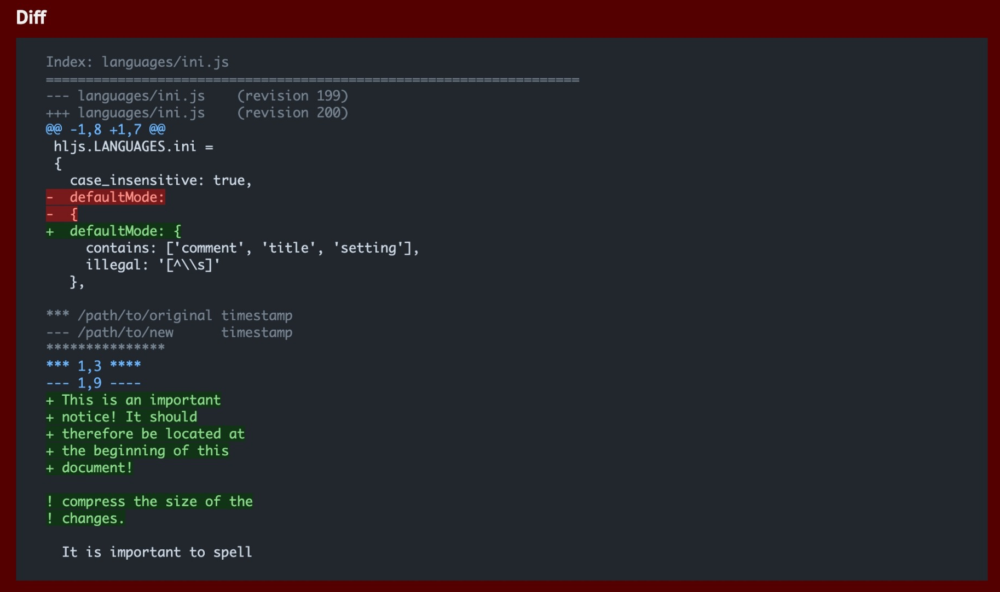
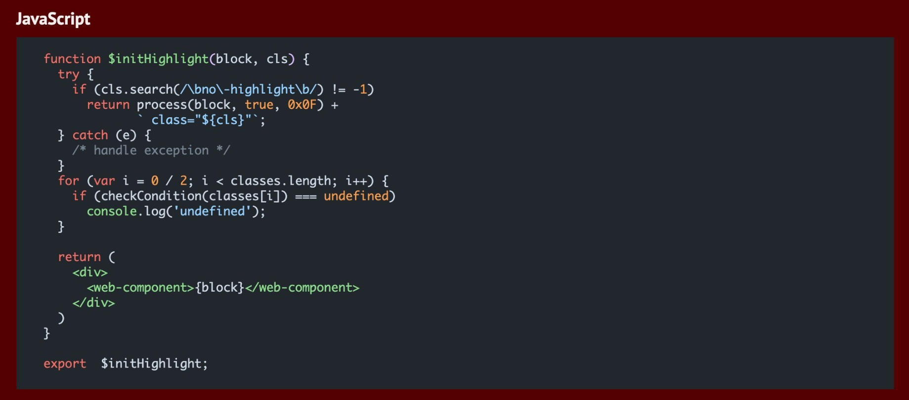

# GitHub Highlight.js themes

Comes with `Dimmed`/`Default Dark`/`Default Light` variations lives in latest [primer/github-vscode-theme](https://github.com/primer/github-vscode-theme/) [#github-com-themes](https://github.com/primer/github-vscode-theme/tree/github-com-themes) branch. Generated from primer color system.

## Screenshots

Only show dimmed theme here (the only theme I want 🤣).

For the complete screenshots:

- [Default Light](./docs/GitHub_Light_Default.jpeg)
- [Default Dark](./docs/GitHub_Dark_Default.jpeg)
- [Dimmed](./docs/GitHub_Dimmed.jpeg)

### Diff

### LICENSE

MIT
